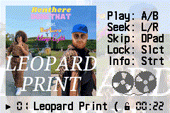

# GSM Player Album Art Fork

## Original GSM Player UI

## Revised UI

This project forks GSM Player with some UI revisions, most notably providing a feature
where arbitrary album artwork can be shown during audio playback. It also provides
everything needed to easily add .wav files and art and build a new ROM.

List of new UI features:
- Displays album artwork
- Current track name, number, timestamp condensed into single line at bottom of screen
- Supports track names up to 64 characters via forked version of GBFS (previous limit was 24 characters)
- Marquee scrolling animation for long track names
- Clear indication of button controls for different functions
- New icons for play state and unlocked state (previously no icon was shown in these states)
- Reel-to-reel tape animation follows track progress
- Hold the Start button to view copyright info for GSM Player

### External build dependencies:
1. Windows (you can make it work elsewhere I'm sure, you just need to rewrite the Go.bat script, and find a copy of Sox that will work or else recreate that part of the script). Many filepaths are hardcoded, you might need to change these.
2. devkitPro (libgba)
3. ImageMagick (for resizing artwork)
4. Node.js (for quantizing artwork to 240 colors and arranging in tile format). All dependencies are included in the repo, no need to install packages.
5. Make

### Project setup
1. Add any .wav files to the wavs/ folder
2. Add your album art (with a .jpg extension) to the art/ folder. Don't use .jpeg, we're using that for the temporary resized file.
3. Search the project for "leopard" (in the Makefile and src/art.c) and change it to whatever your artwork jpg file is called. Mine was called leopard.jpg. I could have tried to make this a variable but I decided to make it your problem.
4. Change the album name and artist name in src/album_info.h.
5. Build the project by running Go.bat. This will create allnewgsm.gba.

You can open allnewgsm.gba in an emulator, or stick it on a flash cart.

### FAQ

#### Can I re-order the songs in the playlist?

The easiest way is to manually pass individual GSM file paths in the desired order to the GBFS executable, rather than using a glob (see GoGBFS.ps1).

#### Can I make the album art look more retro?

In `img2gba/lib-img2gba.js`, change `MAX_COLORS` from 255 to 16.

#### Can I include multiple album artworks?

Currently the art is loaded once and it's assumed all songs use the same artwork, but
it wouldn't be too complicated to add support for one-artwork-per-song. Basically:
- The palette and album artwork tile data would need to be rewritten to match the new selected artwork whenever a song changes bia DMA copy. All you need to do is reference different vars for the different data sources. Note that this currently wpuld need to be done twice, once for the background and once for the sprites. The sprites could be re-inplemented as a background to save cartridge space.
- The grey and white palette for the reel-to-reel animation will also need to be re-written after updating the album art palette.
- The OAM attributes will remain the same, pointing to the changed tile data.

### THANK YOU

I want to thank Damian Yerrick for developing the GSM implementation for GBA and the original GSM player, as well as for porting it to modern devkitARM. This is really the best open source implementation of PCM music playback that I could find on the GBA.

I want to also thank Jasper Vijn and other contributors to the TONC tutorial for Game Boy Advance programming. I was new to this and I ran into several obstacles along the way. Without fail, the answer was somewhere in that guide each time.

P.S. I recommend accessing TONC at [this link](https://gbadev.net/tonc/) and choosing the option to print the whole document as a PDF! Will come in handy when you need to search for something, or if you're on the go.

## Original Readme

GSM Player
==========
In mid-2004, I ported the GSM RPE-LTP (also called GSM Full Rate)
audio codec, which has been used in mobile phones, to the Game Boy
Advance.  Now you can use your GBA as a portable music player, with
up to 150 minutes of Good Sounding Music on a 256 Mbit flash cart. 

From mid-2004 to mid-2019, [GSM Player for GBA] went unmaintained,
and changes to popular GBA homebrew toolchains rendered it
unbuildable.  This repository ports the application to a more
recent version of devkitARM.

[GSM Player for GBA]: https://pineight.com/gba/gsm/

Building a ROM
--------------
1. If building from source:

       make build/allnewgsm-bare_mb.gba
       padbin 256 build/allnewgsm-bare_mb.gba

2. Convert audio files to GSM at 18157 Hz (a nonstandard rate; see
   `docs/lying_to_sox.txt` for how to force this in SoX and FFmpeg)
3. Pack them into a single GBFS file using `gbfs` included with
   devkitARM tools: `gbfs gsmsongs.gbfs *.gsm`
4. Concatenate the player and the songs.
    - On Windows: `copy /b build\allnewgsm-bare_mb.gba+gsmsongs.gbfs allnewgsm.gba`
    - On UNIX: `cat build/allnewgsm-bare_mb.gba gsmsongs.gbfs > allnewgsm.gba`

Controls
--------
To control the player:

- Left: Previous track
- Right: Next track
- L: Seek backward
- R: Seek forward
- Select: Lock other keys
- Start: Pause or resume

Copyright 2004, 2019 Damian Yerrick
