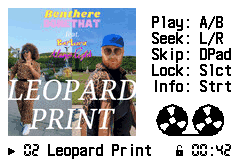

# GSM Player Album Art Fork

## Original GSM Player UI

## Revised UI

This project forks GSM Player with some UI revisions, most notably providing a feature
where arbitrary album artwork can be shown during audio playback. It also provides
everything needed to easily add .wav files and art and build a new ROM.

Currently the art is loaded once and it's assumed all songs use the same artwork, but
it wouldn't be too complicated to add support for one-artwork-per-song. Essentially
the OAM attributes would need to be pointed to a different group of tile addresses
according to the current song. The math is all there so you'd just need to load
your bitmap into an address and use that address as an offset for each OAM tile
address.

### External build dependencies:
1. Windows (you can make it work elsewhere I'm sure, you just need to rewrite the Go.bat script, and find a copy of Sox that will work or else recreate that part of the script). Many filepaths are hardcoded, you might need to change these.
2. devkitPro (libgba)
3. ImageMagick (for resizing artwork)
4. Node.js (for quantizing artwork to 256 colors and arranging in tile format)
5. Make

### Project setup
1. Add any .wav files to the wavs/ folder
2. Add your album art (with a .jpg extension) to the art/ folder. Don't use .jpeg, we're using that for the temporary resized file.
3. Search the project for "leopard" (in the Makefile and src/art.c) and change it to whatever your artwork jpg file is called. Mine was called leopard.jpg. I could have tried to make this a variable but I decided to make it your problem.
4. Build the project by running Go.bat. This will create allnewgsm.gba.

You can open allnewgsm.gba in an emulator, or stick it on a flash cart.

## Original Readme

GSM Player
==========
In mid-2004, I ported the GSM RPE-LTP (also called GSM Full Rate)
audio codec, which has been used in mobile phones, to the Game Boy
Advance.  Now you can use your GBA as a portable music player, with
up to 150 minutes of Good Sounding Music on a 256 Mbit flash cart. 

From mid-2004 to mid-2019, [GSM Player for GBA] went unmaintained,
and changes to popular GBA homebrew toolchains rendered it
unbuildable.  This repository ports the application to a more
recent version of devkitARM.

[GSM Player for GBA]: https://pineight.com/gba/gsm/

Building a ROM
--------------
1. If building from source:

       make build/allnewgsm-bare_mb.gba
       padbin 256 build/allnewgsm-bare_mb.gba

2. Convert audio files to GSM at 18157 Hz (a nonstandard rate; see
   `docs/lying_to_sox.txt` for how to force this in SoX and FFmpeg)
3. Pack them into a single GBFS file using `gbfs` included with
   devkitARM tools: `gbfs gsmsongs.gbfs *.gsm`
4. Concatenate the player and the songs.
    - On Windows: `copy /b build\allnewgsm-bare_mb.gba+gsmsongs.gbfs allnewgsm.gba`
    - On UNIX: `cat build/allnewgsm-bare_mb.gba gsmsongs.gbfs > allnewgsm.gba`

Controls
--------
To control the player:

- Left: Previous track
- Right: Next track
- L: Seek backward
- R: Seek forward
- Select: Lock other keys
- Start: Pause or resume

Copyright 2004, 2019 Damian Yerrick
